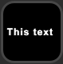
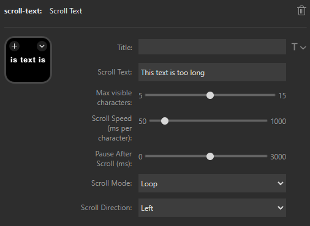

# Stream Deck Scroll Text Plugin

A simple Stream Deck plugin that displays scrolling text on a key. Supports loop and bounce modes, adjustable speed, direction, and pause after each scroll.

## Features
- Scrolls custom text on a Stream Deck key
- Loop or bounce scrolling modes
- Adjustable speed, direction, and window size
- Optional pause after each scroll

## Preview

## Settings

Configure the text, scroll mode, direction, speed, and more in the plugin settings:

## Installation
1. Build or download the plugin package.
2. Install it via the Stream Deck software.
3. Add the "Scroll Text" action to a key and customize the settings.

## License

This project is licensed under the Creative Commons Attribution-NonCommercial 4.0 International License (CC BY-NC 4.0). See the [LICENSE](LICENSE) file for details.

---
**Author:** xIntern